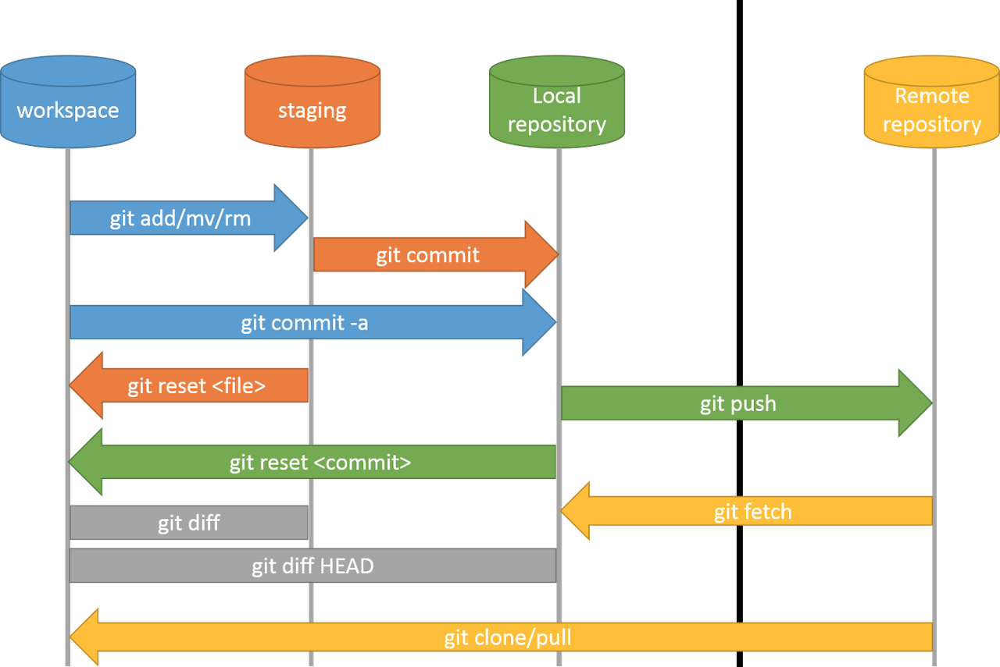

# markdown 문법 # ____

## 제목(heading) ## ____

제목은 `#`으로 작성하며, 갯수로 제목의 레벨을 나타낸다.

### 제목3

#### 제목4

##### 제목5

###### 제목6

## 목록

목록은 순서가 있는 목록과 순서가 없는 목록으로 구분된다.

1. 순서가 있는 목록입니다.

2. 순서가 있네요.

   1. tab키를 통해 목록의 레벨을 설정할 수 있다.
   2. 엔터

   엔터

3. 엔터

엔터

* 순서가 없는 목록(*)
  * tab키를 통해 레벨 설정

## 코드블록

``` sql
-- sql에서 주석(코드블록: ''')
SELECT * FROM tables
```

``` python
# python 주석
print('hello')
def foo():
    return bar
```

``` bash
$ git init
```

## 인용문

> 인용문 작성 가능(> + space) 

## 링크

[google](https://google.com) ([webname]+(url)) ctrl+click

## 표

| 순번   | 이름    | 성별    |
| ------ | ------- | ------- |
| ------ | ------- | ------- |
| 1      | 김김김  | 남      |
| 2      | 박박박  | 여      |

## 이미지

* 기본설정으로는 이미지의 절대경로가 표시되는데 아래의 설정을 typora에 한다.
  * 파일 > 환경설정 > 이미지 탭 클릭
    * copy image to custom folder 클릭
    * `./images`
  * 로컬 이미지에 위 규칙 적용 
  * 온라인 이미지에 위 규칙 적용
  * 가능하다면 상대적 위치 사용
  * 모두 체크



## 기타

##### 수직선

---

(---)

**굵게(볼드체)** (**)

*기울임(이탤릭체)* (*)

~~취소선~~(~~)


